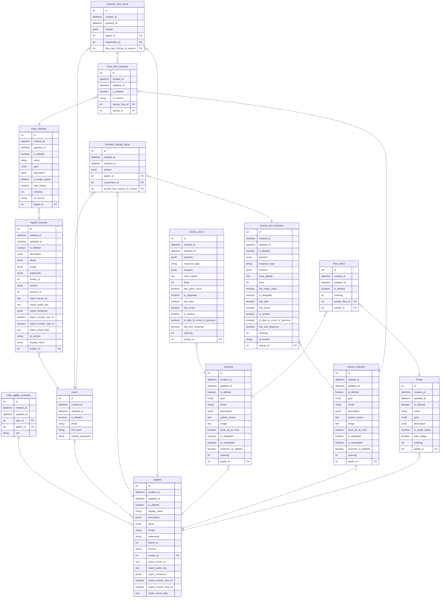

# Child Mind Institute - MindLogger Backend API

This repository is used for the backend of the [MindLogger](https://mindlogger.org/) application stack.

[](https://github.com/ChildMindInstitute/mindlogger-backend-refactor/actions/workflows/tests.yaml)
<a href="https://coverage-badge.samuelcolvin.workers.dev/redirect/ChildMindInstitute/mindlogger-backend-refactor" target="_blank">
    
</a>

## Getting Started

* MindLogger Admin - [GitHub Repo](https://github.com/ChildMindInstitute/mindlogger-admin)
* MindLogger Backend - **This Repo**
* MindLogger Mobile App - [GitHub Repo](https://github.com/ChildMindInstitute/mindlogger-app-refactor)
* MindLogger Web App - [GitHub Repo](https://github.com/ChildMindInstitute/mindlogger-web-refactor)


## Contents
- [Features](#features)
- [Technologies](#technologies)
- [Application](#application-stack)
  - [Prerequisites](#prerequisites)
  - [Environment Variables](#environment-variables)
- [Installation](#installation)
- [Running the app](#running-the-app)
  - [Running locally](#running-locally)
  - [Running via docker](#running-via-docker)
  - [Running using Makefile](#running-using-makefile)
  - [Docker development](#docker-development)
- [Testing](#testing)
- [Scripts](#scripts)
- [Arbitrary setup](#arbitrary-setup)
- [License](#license)

## Features

See MindLogger's [Knowledge Base article](https://mindlogger.atlassian.net/servicedesk/customer/portal/3/topic/4d9a9ad4-c663-443b-b7fc-be9faf5d9383/article/337444910) to discover the MindLogger application stack's features.

## Technologies

- ✅ [Python3.10+](https://www.python.org/downloads/release/python-3108/)
- ✅ [Pipenv](https://pipenv.pypa.io/en/latest/)
- ✅ [FastAPI](https://fastapi.tiangolo.com)
- ✅ [Postgresql](https://www.postgresql.org/docs/14/index.html)
- ✅ [Redis](https://redis.io)
- ✅ [Docker](https://docs.docker.com/get-docker/)
- ✅ [Pydantic](https://pydantic-docs.helpmanual.io)
- ✅ [SQLAlchemy](https://www.sqlalchemy.org/)

And

- ✅ [The 12-Factor App](https://12factor.net)

**Code quality tools:**

- ✅ [ruff](https://github.com/astral-sh/ruff)
- ✅ [isort](https://github.com/PyCQA/isort)
- ✅ [mypy](https://github.com/python/mypy)
- ✅ [pytest](https://github.com/pytest-dev/pytest)

## Application

### Prerequisites

- Python 3.10 - This project requires Python 3.10 as `aioredis` is [incompatible with 3.11+](https://github.com/aio-libs-abandoned/aioredis-py/issues/1409)
- [Docker](https://docs.docker.com/get-docker/)

#### Recommended Extras

Installing [pyenv](https://github.com/pyenv/pyenv) is recommended to automatically manage Python version in the virtual environment specified in the `Pipfile`

Alternatively, on macOS you can use a tool like [Homebrew](https://brew.sh/) to install multiple versions and specify when creating the virtual environment:

```bash
pipenv --python /opt/homebrew/bin/python3.10
```

### Environment Variables

| Key                                                          | Default value              | Description                                                                                                                                                                                                                                                                                                                            |
|--------------------------------------------------------------|----------------------------|----------------------------------------------------------------------------------------------------------------------------------------------------------------------------------------------------------------------------------------------------------------------------------------------------------------------------------------|
| DATABASE\_\_HOST                                             | postgres                   | Database Host                                                                                                                                                                                                                                                                                                                          |
| DATABASE\_\_USER                                             | postgres                   | User name for Postgresql Database user                                                                                                                                                                                                                                                                                                 |
| DATABASE\_\_PASSWORD                                         | postgres                   | Password for Postgresql Database user                                                                                                                                                                                                                                                                                                  |
| DATABASE\_\_DB                                               | mindlogger_backend         | Database name                                                                                                                                                                                                                                                                                                                          |
| CORS\_\_ALLOW\_ORIGINS                                       | `*`                        | Represents the list of allowed origins. Set the `Access-Control-Allow-Origin` header. Example: `https://dev.com,http://localohst:8000`                                                                                                                                                                                                 |
| CORS\_\_ALLOW\_ORIGINS\_REGEX                                | -                          | Regex pattern of allowed origins.                                                                                                                                                                                                                                                                                                      |
| CORS\_\_ALLOW\_CREDENTIALS                                   | true                       | Set the `Access-Control-Allow-Credentials` header                                                                                                                                                                                                                                                                                      |
| CORS\_\_ALLOW_METHODS                                        | `*`                        | Set the `Access-Control-Allow-Methods` header                                                                                                                                                                                                                                                                                          |
| CORS\_\_ALLOW_HEADERS                                        | `*`                        | Set the `Access-Control-Allow-Headers` header                                                                                                                                                                                                                                                                                          |
| AUTHENTICATION\_\_ACCESS\_TOKEN\_\_SECRET\_KEY               | secret1                    | Access token's salt                                                                                                                                                                                                                                                                                                                    |
| AUTHENTICATION\_\_REFRESH\_TOKEN\_\_SECRET\_KEY              | secret2                    | Refresh token salt                                                                                                                                                                                                                                                                                                                     |
| AUTHENTICATION\_\_REFRESH\_TOKEN\_\_TRANSITION\_KEY          | transition secret          | Transition refresh token salt. Used for changing refresh token key (generate new key for AUTHENTICATION\_\_REFRESH\_TOKEN\_\_SECRET\_KEY and use previous value as transition token key for accepting previously generated refresh tokens during transition period (see AUTHENTICATION\_\_REFRESH\_TOKEN\_\_TRANSITION\_EXPIRE\_DATE)) |
| AUTHENTICATION\_\_REFRESH\_TOKEN\_\_TRANSITION\_EXPIRE\_DATE | transition expiration date | Transition expiration date. After this date transition token ignored                                                                                                                                                                                                                                                                   |
| AUTHENTICATION\_\_ALGORITHM                                  | HS256                      | The JWT's algorithm                                                                                                                                                                                                                                                                                                                    |
| AUTHENTICATION\_\_ACCESS\_TOKEN\_\_EXPIRATION                | 30                         | Time in minutes after which the access token will stop working                                                                                                                                                                                                                                                                         |
| AUTHENTICATION\_\_REFRESH\_TOKEN\_\_EXPIRATION               | 30                         | Time in minutes after which the refresh token will stop working                                                                                                                                                                                                                                                                        |
| ADMIN_DOMAIN                                                 | -                          | Admin panel domain                                                                                                                                                                                                                                                                                                                     |
| RABBITMQ\_\_URL                                              | rabbitmq                   | Rabbitmq service URL                                                                                                                                                                                                                                                                                                                   |
| RABBITMQ\_\_USE_SSL                                          | True                       | Rabbitmq ssl setting, turn false to local development                                                                                                                                                                                                                                                                                  |
| MAILING\_\_MAIL\_\_USERNAME                                  | mailhog                    | Mail service username                                                                                                                                                                                                                                                                                                                  |
| MAILING\_\_MAIL\_\_PASSWORD                                  | mailhog                    | Mail service password                                                                                                                                                                                                                                                                                                                  |
| MAILING\_\_MAIL\_\_SERVER                                    | mailhog                    | Mail service URL                                                                                                                                                                                                                                                                                                                       |
| SECRETS\_\_SECRET\_KEY                                       | -                          | Secret key for data encryption. Use this key only for local development                                                                                                                                                                                                                                                                |

##### ✋ Mandatory:

> You can see that some environment variables have double underscore (`__`) instead of `_`.
>
> As far as `pydantic` supports [nested settings models](https://pydantic-docs.helpmanual.io/usage/settings/) it uses to have cleaner code

> 💡 **TIP:** If you're using pipenv, be sure to reactivate your virtual environment after changing your environment variables.
> ```bash
> exit
> pipenv shell
> ```

## Installation

### Create `.env` file for future needs

It is highly recommended to create an `.env` file as far as it is needed for setting up the project with Local and Docker approaches.
Use `.env.default` to get started:\
```bash
cp .env.default .env
```

> 🛑 **NOTE:** Make sure to set `RABBITMQ__USE_SSL=False` for local development

### Generate secret keys, update .env with values

```bash
openssl rand -hex 32
```

Generate a key and update `.env` values:

* `AUTHENTICATION__ACCESS_TOKEN__SECRET_KEY`
* `AUTHENTICATION__REFRESH_TOKEN__SECRET_KEY`

### Required Services

- Postgres
- Redis
- RabbitMQ
- Mailhog - Only used for running mail services locally

Running required services using Docker is **highly** recommended even if you intend to run the app locally.

> 🛑 **NOTE:** Make sure to update your environment variables to point to the correct hostname and port for each service.

#### Run services using Docker

- Run Postgres
  ```bash
  docker-compose up -d postgres
  ```

- Run Redis
  ```bash
  docker-compose up -d redis
  ```

- Run RabbitMQ
  ```bash
  docker-compose up -d rabbitmq
  ```

- Alternatively, you can run all required services:
  ```bash
  docker-compose up
  ```

#### Run services manually

For manual installation refer to each service's documentation:

- [PostgreSQL Downloads](https://www.postgresql.org/download/)
- [Redis: Install Redis](https://redis.io/docs/install/install-redis/)
- [RabbitMQ documentation](https://rabbitmq-website.pages.dev/docs/download)


### Install all project dependencies

Pipenv used as a default dependencies manager
Create your virtual environment:
```bash
# Activate your environment
pipenv shell
```

If `pyenv` is installed Python 3.10 should automatically be installed in the virtual environment, you can check the correct version of Python is active by running:
```bash
python --version
```

If the active version is **not** 3.10, you can manually specify a version while creating your virtual environment:
```bash
pipenv --python /opt/homebrew/bin/python3.10
```

Install all dependencies
```bash
# Install all deps from Pipfile.lock
# to install venv to current directory use `export PIPENV_VENV_IN_PROJECT=1`
pipenv sync --dev
```

> 💡 **TIP:** Be sure to run reactivate your virtual environment after changing your environment variables.
> ```bash
> exit
> pipenv shell
> ```

> 🛑 **NOTE:** if you don't use `pipenv` for some reason remember that you will not have automatically exported variables from your `.env` file.
>
> 🔗 [Pipenv docs](https://docs.pipenv.org/advanced/#automatic-loading-of-env)

So then you have to do it by your own manually

```bash
# Manual exporting in Unix (like this)
export PYTHONPATH=src/
export BASIC_AUTH__PASSWORD=1234
...
```

...or using a Bash-script

```bash
set -o allexport; source .env; set +o allexport
```

> 🛑 **NOTE:** Please do not forget about environment variables! Now all environment variables for the Postgres Database which runs in docker are already passed to docker-compose.yaml from the .env file.

## Running the app

### Running locally

This option allows you to run the app for development purposes without having to manually build the Docker image.

- Make sure all [required services](#required-services) are properly setup
- If you're running required services using Docker, disable the `app` service from `docker-compose` before running:
  ```bash
  docker-compose up -d
  ```

  Alternatively, you may run these services using [make](#running-using-makefile):
  ```bash
  make run_local
  ```

> 🛑 **NOTE:** Don't forget to set the `PYTHONPATH` environment variable, e.g: export PYTHONPATH=src/

In project we use simplified version of imports: `from apps.application_name import class_name, function_name, module_nanme`.

To do this we must have `src/` folder specified in a **PATH**.

P.S. You don't need to do this additional step if you run application via Docker container 🤫

```bash
uvicorn src.main:app --proxy-headers --port {PORT} --reload
```

Alternatively, you may run the application using [make](#running-using-makefile):
```bash
make run
```
### Running via docker

- [Build the application](#build-application-images)
- Run the app using Docker:
```bash
docker-compose up
```

Additional `docker-compose up` flags that might be useful for development

```bash
-d  # Run docker containers as deamons (in background)
--no-recreate  # If containers already exist, don't recreate them
```

#### Stop the application 🛑

```bash
docker-compose down
```

Additional `docker-compose down` flags that might be useful for development

```bash
-v  # Remove with all volumes
```
### Running using Makefile

You can use the `Makefile` to work with project (run the application / code quality tools / tests ...)

For local usage:

```bash
# Run the application
make run

# Check the code quality
make cq

# Check tests passing
make test

# Check everything in one hop
make check
```
### Docker development

#### Build application images

```bash
docker-compose build
```

✅ Make sure that you completed `.env` file. It is using by default in `docker-compose.yaml` file for buildnig.

✅ Check building with `docker images` command. You should see the record with `fastapi_service`.

💡 If you would like to debug the application insode Docker comtainer make sure that you use `COMPOSE_FILE=docker-compose.dev.yaml` in `.env`. It has opened stdin and tty.

## Testing

The `pytest` framework is using in order to write unit tests.
Currently postgresql is used as a database for tests with running configurations that are defined in `pyproject.toml`

```toml
DATABASE__HOST=postgres
DATABASE__PORT=5432
DATABASE__PASSWORD=postgres
DATABASE__USER=postgres
DATABASE__DB=test
```

> 🛑 **NOTE:** To run tests localy without changing DATABASE_HOST please add row below to the `/etc/hosts` file (macOS, Linux). It will automatically redirect postgres to the localhost.

```
127.0.0.1       postgres
```

### Adjust your database for using with tests

⚠️️ Remember that you have to do this only once before the first test.

```base
# Connect to the database with Docker
docker-compose exec postgres psql -U postgres postgres

# Or connect to the database locally
psql -U postgres postgres


# Create user's database
psql# create database test;

# Create arbitrary database
psql# create database test_arbitrary;

# Create user test
psql# create user test;

# Set password for the user
psql# alter user test with password 'test';
```

### Test coverage

To correctly calculate test coverage, you need to run the coverage with the `--concurrency=thread,gevent` parameter:

```bash
coverage run --branch --concurrency=thread,gevent -m pytest
coverage report -m
```

### Running test via docker

(This is how tests are running on CI)

```bash
# Check the code quality
make dcq

# Check tests passing
make dtest

# Check everything in one hop
make dcheck
```

## Scripts

### Using pre-commit hooks

It is a good practice to use Git hooks to provide better commits.

For increased security during development, install `git-secrets` to scan code for aws keys.

Please use this link for that: https://github.com/awslabs/git-secrets#installing-git-secrets

`.pre-commit-config.yaml` is placed in the root of the repository.

👉 Once you have installed `git-secrets` and `pre-commit` simply run the following command.

```bash
make aws-scan
```

👉 Then all your staged cahnges will be checked via git hooks on every `git commit`

### Alembic (migration)

#### Add a new migrations file 🔨

```bash
alembic revision --autogenerate -m "Add a new field"
```

#### Upgrade to the latest migration 🔨

```bash
alembic upgrade head
```

#### Downgrade to the specific one 🔨

```bash
alembic downgrade 0e43c346b90d
```

✅ This hash is taken from the generated file in the migrations folder

#### Downgrade to the specific one 🔨

```bash
alembic downgrade 0e43c346b90d
```

#### Removing the migration 🔨

💡 Do not forget that alembic saves the migration version into the database.

```bash
delete from alembic_version;
```

#### Upgrade arbitrary servers

```bash
alembic -c alembic_arbitrary.ini upgrade head
```

#### Database relation structure



## Arbitrary setup

You can connect arbitrary file storage and database by filling special fields in table `user_workspaces`.

### PostgreSQL

Add your database connection string into `database_uri`
In next format:

```
postgresql+asyncpg://<username>:<password>@<hostname>:port/database
```

### AWS S3 and GCP S3

For AWS S3 bucket next fields are required:
`storage_region`,`storage_bucket`, `storage_access_key`,`storage_secret_key`.

### Azure Blob

In case of Azure blob, specify your connection string into field `storage_secret_key`

## License
Common Public Attribution License Version 1.0 (CPAL-1.0)

Refer to [LICENSE.md](./LICENSE.MD)

## Opentelemtry
### If app is running in docker
- Make sure that `OTEL_EXPORTER_OTLP_TRACES_ENDPOINT=http://opentelemetry:4317` endpoint has been already set in `.env`. Run docker container with opentelemetry:
```bash
docker-compose up -d opentelemetry
```
### If app is running locally
- Make sure that `OTEL_EXPORTER_OTLP_TRACES_ENDPOINT=http://localhost:4317` is exported in environment.
```bash
export OTEL_EXPORTER_OTLP_TRACES_ENDPOINT=http://localhost:4317
```
or if you use pipenv for autoloading envs - make sure that `OTEL_EXPORTER_OTLP_TRACES_ENDPOINT=http://localhost:4317` is added to `.env` file.
- The same as for containerized app - up container with opentelemetry
```
```bash
docker-compose up -d opentelemetry
```
- Start you app
