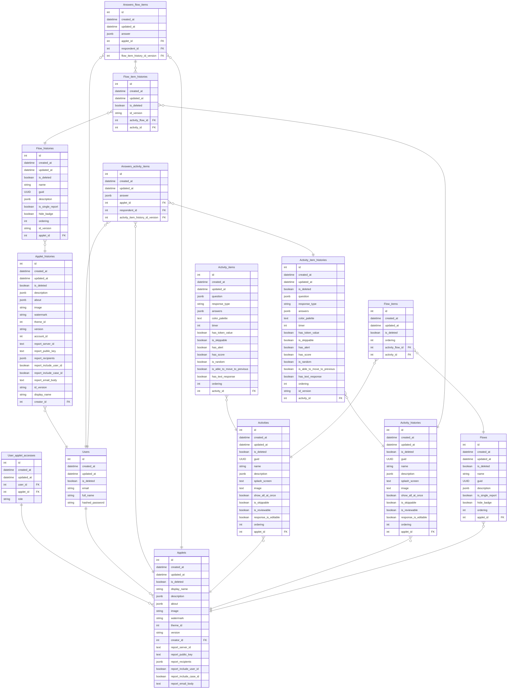

# Child Mind Institute - Curious Backend API

This repository is used for the backend of the [Curious](https://mindlogger.org/) application stack.

[](https://github.com/ChildMindInstitute/mindlogger-backend-refactor/actions/workflows/tests.yaml)
<a href="https://coverage-badge.samuelcolvin.workers.dev/redirect/ChildMindInstitute/mindlogger-backend-refactor" target="_blank">
    
</a>

## Getting Started

* Curious Admin - [GitHub Repo](https://github.com/ChildMindInstitute/mindlogger-admin)
* Curious Backend - **This Repo**
* Curious Mobile App - [GitHub Repo](https://github.com/ChildMindInstitute/mindlogger-app-refactor)
* Curious Web App - [GitHub Repo](https://github.com/ChildMindInstitute/mindlogger-web-refactor)


## Features

See
Curious's [Knowledge Base article](https://mindlogger.atlassian.net/servicedesk/customer/portal/3/topic/4d9a9ad4-c663-443b-b7fc-be9faf5d9383/article/337444910)
to discover the Curious application stack's features.

## Technologies

- ✅ [Python 3.13](https://www.python.org/downloads/release/python-3132/)
- ✅ [Pipenv](https://pipenv.pypa.io/en/latest/)
- ✅ [FastAPI](https://fastapi.tiangolo.com)
- ✅ [Postgresql](https://www.postgresql.org/docs/14/index.html)
- ✅ [Redis](https://redis.io)
- ✅ [Docker](https://docs.docker.com/get-docker/)
- ✅ [Pydantic](https://pydantic-docs.helpmanual.io)
- ✅ [SQLAlchemy](https://www.sqlalchemy.org/)

And

- ✅ [The 12-Factor App](https://12factor.net)

**Code quality tools:**

- ✅ [ruff](https://github.com/astral-sh/ruff)
- ✅ [mypy](https://github.com/python/mypy)
- ✅ [pytest](https://github.com/pytest-dev/pytest)

## Application

### Prerequisites

- [Homebrew](https://brew.sh/) (MacOS)
- [uv](https://docs.astral.sh/uv/)
- [Docker](https://docs.docker.com/get-docker/)

On MacOS:
```bash
brew install uv
```

On other plaftorms, follow the [uv install instructions](https://docs.astral.sh/uv/getting-started/installation/)

### Installing Dependencies

uv is used as a default dependencies and python manager.

#### Install Python

uv can automatically install the python version defined in `.python-version`.  It will use this version when
performing any python operations.

```bash
uv python install
```

> ⚠️ If the python version changes (ex: from 3.12 to 3.13) this command will need to be rerun

#### Install Project Dependencies
Install all deps from pyproject.toml
```bash
uv sync
```

## Project Setup

### Environment Variables

#### Create `.env` file for local development

It is highly recommended to create an `.env` file as far as it is needed for setting up the project with 
local and Docker approaches.

Use `.env.default` as a baseline to get started.  It has valid defaults for local development set:

```bash
cp .env.default .env
```

> 🛑 **NOTE:** Make sure to set `RABBITMQ__USE_SSL=False` for local development

### Environment Variable Reference

| Key                                                          | Default value              | Description                                                                                                                                                                                                                                                                                                                            |
|--------------------------------------------------------------|----------------------------|----------------------------------------------------------------------------------------------------------------------------------------------------------------------------------------------------------------------------------------------------------------------------------------------------------------------------------------|
| DATABASE\_\_HOST                                             | postgres                   | Database Host                                                                                                                                                                                                                                                                                                                          |
| DATABASE\_\_USER                                             | postgres                   | User name for Postgresql Database user                                                                                                                                                                                                                                                                                                 |
| DATABASE\_\_PASSWORD                                         | postgres                   | Password for Postgresql Database user                                                                                                                                                                                                                                                                                                  |
| DATABASE\_\_DB                                               | mindlogger_backend         | Database name                                                                                                                                                                                                                                                                                                                          |
| CORS\_\_ALLOW\_ORIGINS                                       | `*`                        | Represents the list of allowed origins. Set the `Access-Control-Allow-Origin` header. Example: `https://dev.com,http://localohst:8000`                                                                                                                                                                                                 |
| CORS\_\_ALLOW\_ORIGINS\_REGEX                                | -                          | Regex pattern of allowed origins.                                                                                                                                                                                                                                                                                                      |
| CORS\_\_ALLOW\_CREDENTIALS                                   | true                       | Set the `Access-Control-Allow-Credentials` header                                                                                                                                                                                                                                                                                      |
| CORS\_\_ALLOW_METHODS                                        | `*`                        | Set the `Access-Control-Allow-Methods` header                                                                                                                                                                                                                                                                                          |
| CORS\_\_ALLOW_HEADERS                                        | `*`                        | Set the `Access-Control-Allow-Headers` header                                                                                                                                                                                                                                                                                          |
| AUTHENTICATION\_\_ACCESS\_TOKEN\_\_SECRET\_KEY               | secret1                    | Access token's salt                                                                                                                                                                                                                                                                                                                    |
| AUTHENTICATION\_\_REFRESH\_TOKEN\_\_SECRET\_KEY              | secret2                    | Refresh token salt                                                                                                                                                                                                                                                                                                                     |
| AUTHENTICATION\_\_REFRESH\_TOKEN\_\_TRANSITION\_KEY          | transition secret          | Transition refresh token salt. Used for changing refresh token key (generate new key for AUTHENTICATION\_\_REFRESH\_TOKEN\_\_SECRET\_KEY and use previous value as transition token key for accepting previously generated refresh tokens during transition period (see AUTHENTICATION\_\_REFRESH\_TOKEN\_\_TRANSITION\_EXPIRE\_DATE)) |
| AUTHENTICATION\_\_REFRESH\_TOKEN\_\_TRANSITION\_EXPIRE\_DATE | transition expiration date | Transition expiration date. After this date transition token ignored                                                                                                                                                                                                                                                                   |
| AUTHENTICATION\_\_ALGORITHM                                  | HS256                      | The JWT's algorithm                                                                                                                                                                                                                                                                                                                    |
| AUTHENTICATION\_\_ACCESS\_TOKEN\_\_EXPIRATION                | 30                         | Time in minutes after which the access token will stop working                                                                                                                                                                                                                                                                         |
| AUTHENTICATION\_\_REFRESH\_TOKEN\_\_EXPIRATION               | 30                         | Time in minutes after which the refresh token will stop working                                                                                                                                                                                                                                                                        |
| ADMIN_DOMAIN                                                 | -                          | Admin panel domain                                                                                                                                                                                                                                                                                                                     |
| RABBITMQ\_\_URL                                              | rabbitmq                   | Rabbitmq service URL                                                                                                                                                                                                                                                                                                                   |
| RABBITMQ\_\_USE_SSL                                          | True                       | Rabbitmq ssl setting, turn false to local development                                                                                                                                                                                                                                                                                  |
| MAILING\_\_MAIL\_\_USERNAME                                  | mailhog                    | Mail service username                                                                                                                                                                                                                                                                                                                  |
| MAILING\_\_MAIL\_\_PASSWORD                                  | mailhog                    | Mail service password                                                                                                                                                                                                                                                                                                                  |
| MAILING\_\_MAIL\_\_SERVER                                    | mailhog                    | Mail service URL                                                                                                                                                                                                                                                                                                                       |
| MULTI\_INFORMANT\_\_TEMP\_RELATION\_EXPIRY\_SECS             | 86400                      | Expiry (sec) of temporary multi-informant participant take now relation                                                                                                                                                                                                                                                                |
| SECRETS\_\_SECRET\_KEY                                       | -                          | Secret key for data encryption. Use this key only for local development                                                                                                                                                                                                                                                                |
| ONEUP\_HEALTH\_\_CLIENT\_ID                                  | -                          | OneUpHealth API Client ID                                                                                                                                                                                                                                                                                                              |
| ONEUP\_HEALTH\_\_CLIENT\_SECRET                              | -                          | OneUpHealth API Client secret                                                                                                                                                                                                                                                                                                          |
| ONEUP\_HEALTH\_\_MAX\_ERROR\_RETRIES                         | 5                          | Maximum number of times to re-attempt fetching health data from the OneUpHealth API. The overall total number of attempts will be this value plus one                                                                                                                                                                                  |

> ✋You can see that some environment variables have double underscore (`__`) instead of `_`.
>
> As far as `pydantic` supports [nested settings models](https://pydantic-docs.helpmanual.io/usage/settings/) it uses to have cleaner code


## Running Supporting Services

The application requires Postgres, Redis and RabbitMQ to be running to start up and serve requests
(as well as run the test suite).

If mail services are needed, mailhog is required and is provided via docker compose.

If uploading media files to applets or answers, then an S3 compatible service is needed.  Minio is provided
via docker compose.

#### Run services using Docker

- Run Postgres
  ```bash
  docker-compose up -d postgres
  ```

- Run Redis
  ```bash
  docker-compose up -d redis
  ```

- Run RabbitMQ
  ```bash
  docker-compose up -d rabbitmq
  ```

- Alternatively, you can run all required for the backend:
  ```bash
  docker-compose up postgres redis rabbitmq
  ```

- If you also need mail and S3 storage service
  ```bash
  docker-compose up postgres redis rabbitmq mailhog minio
  ```

> ⚠️ When using Minio more configuration is needed to configure boto3 to talk to the local endpoints
> ```
> AWS_ACCESS_KEY_ID=minioadmin
> AWS_SECRET_ACCESS_KEY=minioadmin
> AWS_ENDPOINT_URL=http://localhost:9000
> AWS_DEFAULT_REGION=us-east-1
> ```

> 🛑 **NOTE:** If the application can't find the `RabbitMQ` service even though it's running normally, change your
`RABBITMQ__URL` to your local ip address instead of `localhost`

## Run the migrations

The database needs to be initialized with tables and starting data.

```bash
uv run alembic upgrade head
```

## Other Local Setup

If you are on a unix type system (Linux, MacOS, WSL, etc) add these entries to `/etc/hosts`.  This will need to be
done with elevated privileges (ex: `sudo vi /etc/hosts`)

```
  #mindlogger
  127.0.0.1 postgres
  127.0.0.1 rabbitmq
  127.0.0.1 redis
  127.0.0.1 mailhog
  ```

## Running the app

### Running locally via Docker

To run all services:
```bash
docker-compose up app
```

To run just the application:
Make sure all [required services](#required-services) are properly setup and running

Then start just the app:
  ```bash
  docker-compose up app
  ```

### Running locally via the CLI

```bash
uvicorn src.main:app --proxy-headers --port {PORT} --reload
```

Alternatively, you may run the application using [make](#running-using-makefile):
```bash
make run
```


### Running using Makefile

You can use the `Makefile` to work with project (run the application / code quality tools / tests ...)

For local usage:

```bash
# Run the application
make run

# Check the code quality
make cq

# Check and fix code quality
make cqf

# Check tests passing
make test

# Check everything in one hop
make check
```
### Docker development

#### Build application images

```bash
docker-compose build
```

✅ Make sure that you completed `.env` file. It is using by default in `docker-compose.yaml` file for buildnig.

✅ Check building with `docker images` command. You should see the record with `fastapi_service`.

💡 If you would like to debug the application insode Docker comtainer make sure that you use `COMPOSE_FILE=docker-compose.dev.yaml` in `.env`. It has opened stdin and tty.

## Testing

The `pytest` framework is using in order to write unit tests.
Currently postgresql is used as a database for tests with running configurations that are defined in `pyproject.toml`

```toml
DATABASE__HOST=postgres
DATABASE__PORT=5432
DATABASE__PASSWORD=postgres
DATABASE__USER=postgres
DATABASE__DB=test
```

> 🛑 **NOTE:** To run tests localy without changing DATABASE_HOST please add row below to the `/etc/hosts` file (macOS, Linux). It will automatically redirect postgres to the localhost.

```
127.0.0.1       postgres
```

### Adjust your database for using with tests

⚠️️ Remember that you have to do this only once before the first test.

```base
# Connect to the database with Docker
docker-compose exec postgres psql -U postgres postgres

# Or connect to the database locally
psql -U postgres postgres


# Create user's database
psql# create database test;

# Create arbitrary database
psql# create database test_arbitrary;

# Create user test
psql# create user test;

# Set password for the user
psql# alter user test with password 'test';
```

### Test coverage

To correctly calculate test coverage, you need to run the coverage with the `--concurrency=thread,gevent` parameter:

```bash
coverage run --branch --concurrency=thread,gevent -m pytest
coverage report -m
```

### Running test via docker

(This is how tests are running on CI)

```bash
# Check the code quality
make dcq

# Check tests passing
make dtest

# Check everything in one hop
make dcheck
```

## Scripts

### Using pre-commit hooks

It is a good practice to use Git hooks to provide better commits.

For increased security during development, install `git-secrets` to scan code for aws keys.

Please use this link for that: https://github.com/awslabs/git-secrets#installing-git-secrets

`.pre-commit-config.yaml` is placed in the root of the repository.

👉 Once you have installed `git-secrets` and `pre-commit` simply run the following command.

```bash
make aws-scan
```

👉 Then all your staged changes will be checked via git hooks on every `git commit`

### Alembic (migration)

#### Add a new migrations file 🔨

```bash
alembic revision --autogenerate -m "Add a new field"
```

#### Upgrade to the latest migration 🔨

```bash
alembic upgrade head
```

#### Downgrade to the specific one 🔨

```bash
alembic downgrade 0e43c346b90d
```

✅ This hash is taken from the generated file in the migrations folder

#### Downgrade to the specific one 🔨

```bash
alembic downgrade 0e43c346b90d
```

#### Removing the migration 🔨

💡 Do not forget that alembic saves the migration version into the database.

```bash
delete from alembic_version;
```

#### Upgrade arbitrary servers

```bash
alembic -c alembic_arbitrary.ini upgrade head
```

### Update gender_screen and age_screen activity items strings to greek for an applet

```bash
python src/cli.py patch exec M2-8568 -a <applet_id>
```

> [!NOTE]
> You can use environment variables to overwrite default values.
>
> | Environment variable | Text string |
> | - | - |
> | `AGE_SCREEN_QUESTION_TRANSLATION` | Question text for the Age screen |
> | `GENDER_SCREEN_QUESTION_TRANSLATION` | Question text for the Gender screen |
> | `GENDER_SCREEN_RESPONSE_MALE_TRANSLATION` | "Male" response text |
> | `GENDER_SCREEN_RESPONSE_FEMALE_TRANSLATION` | "Female" response text |

### Library cleanup

You can use the following command to remove entries from the `library` table (as the Library feature lacks a delete endpoint):

```bash
python src/cli.py patch exec M2-9015 --applets '{"<applet_id>": "<applet_name>", ...}'
```

## Database relation structure


```mermaid

erDiagram

User_applet_accesses ||--o{ Applets: ""

    User_applet_accesses {
        int id
        datetime created_at
        datetime updated_at
        int user_id FK
        int applet_id FK
        string role
    }

    Users {
        int id
        datetime created_at
        datetime updated_at
        boolean is_deleted
        string email
        string full_name
        string hashed_password
    }

 Users||--o{ Applets : ""

    Applets {
        int id
        datetime created_at
        datetime updated_at
        boolean is_deleted
        string display_name
        jsonb description
        jsonb about
        string image
        string watermark
        int theme_id
        string version
        int creator_id FK
        text report_server_id
        text report_public_key
        jsonb report_recipients
        boolean report_include_user_id
        boolean report_include_case_id
        text report_email_body
    }

Applet_histories }o--|| Users: ""

    Applet_histories {
        int id
        datetime created_at
        datetime updated_at
        boolean is_deleted
        jsonb description
        jsonb about
        string image
        string watermark
        int theme_id
        string version
        int account_id
        text report_server_id
        text report_public_key
        jsonb report_recipients
        boolean report_include_user_id
        boolean report_include_case_id
        text report_email_body
        string id_version
        string display_name
        int creator_id FK
    }

Answers_activity_items }o--|| Applets: ""
Answers_activity_items }o--|| Users: ""
Answers_activity_items }o--|| Activity_item_histories: ""

    Answers_activity_items {
        int id
        datetime created_at
        datetime updated_at
        jsonb answer
        int applet_id FK
        int respondent_id FK
        int activity_item_history_id_version FK
    }

Answers_flow_items }o--|| Applets: ""
Answers_flow_items }o--|| Users: ""
Answers_flow_items ||--o{ Flow_item_histories: ""

    Answers_flow_items {
        int id
        datetime created_at
        datetime updated_at
        jsonb answer
        int applet_id FK
        int respondent_id FK
        int flow_item_history_id_version FK
    }

Activities }o--|| Applets: ""

    Activities {
        int id
        datetime created_at
        datetime updated_at
        boolean is_deleted
        UUID guid
        string name
        jsonb description
        text splash_screen
        text image
        boolean show_all_at_once
        boolean is_skippable
        boolean is_reviewable
        boolean response_is_editable
        int ordering
        int applet_id FK
    }

Activity_histories }o--|| Applets: ""

    Activity_histories {
        int id
        datetime created_at
        datetime updated_at
        boolean is_deleted
        UUID guid
        string name
        jsonb description
        text splash_screen
        text image
        boolean show_all_at_once
        boolean is_skippable
        boolean is_reviewable
        boolean response_is_editable
        int ordering
        int applet_id FK
    }

Activity_item_histories }o--|| Activity_histories: ""

    Activity_item_histories {
        int id
        datetime created_at
        datetime updated_at
        boolean is_deleted
        jsonb question
        string response_type
        jsonb answers
        text color_palette
        int timer
        boolean has_token_value
        boolean is_skippable
        boolean has_alert
        boolean has_score
        boolean is_random
        boolean is_able_to_move_to_previous
        boolean has_text_response
        int ordering
        string id_version
        int activity_id FK
    }

Activity_items }o--|| Activities: ""

    Activity_items {
        int id
        datetime created_at
        datetime updated_at
        jsonb question
        string response_type
        jsonb answers
        text color_palette
        int timer
        boolean has_token_value
        boolean is_skippable
        boolean has_alert
        boolean has_score
        boolean is_random
        boolean is_able_to_move_to_previous
        boolean has_text_response
        int ordering
        int activity_id FK
    }


Flows }o--|| Applets: ""

    Flows {
        int id
        datetime created_at
        datetime updated_at
        boolean is_deleted
        string name
        UUID guid
        jsonb description
        boolean is_single_report
        boolean hide_badge
        int ordering
        int applet_id FK
    }

Flow_items }o--|| Flows: ""
Flow_items }o--|| Activities: ""

    Flow_items {
        int id
        datetime created_at
        datetime updated_at
        boolean is_deleted
        int ordering
        int activity_flow_id FK
        int activity_id FK
    }

Flow_item_histories }o--|| Flow_histories: ""
Flow_item_histories }o--|| Activity_histories: ""

    Flow_item_histories {
        int id
        datetime created_at
        datetime updated_at
        boolean is_deleted
        string id_version
        int activity_flow_id FK
        int activity_id FK
    }

Flow_histories }o--|| Applet_histories: ""

    Flow_histories {
        int id
        datetime created_at
        datetime updated_at
        boolean is_deleted
        string name
        UUID guid
        jsonb description
        boolean is_single_report
        boolean hide_badge
        int ordering
        string id_version
        int applet_id FK
    }


```

## Arbitrary setup

You can connect arbitrary file storage and database by filling special fields in table `user_workspaces`.

### PostgreSQL

Add your database connection string into `database_uri`
In next format:

```
postgresql+asyncpg://<username>:<password>@<hostname>:port/database
```

### AWS S3 and GCP S3

For AWS S3 bucket next fields are required:
`storage_region`,`storage_bucket`, `storage_access_key`,`storage_secret_key`.

### Azure Blob

In case of Azure blob, specify your connection string into field `storage_secret_key`

## License
Common Public Attribution License Version 1.0 (CPAL-1.0)

Refer to [LICENSE.md](./LICENSE.MD)

---

## Command Line Interface (CLI)

This project provides a powerful CLI for backend operations, available via `src/cli.py` and powered by [Typer](https://typer.tiangolo.com/). You can use it to manage migrations, patches, encryption, applet seeding, arbitrary server settings, and more.

### Usage

```bash
python src/cli.py [COMMAND] [SUBCOMMAND] [OPTIONS]
```

### Available Top-Level Commands
- `arbitrary` – Manage arbitrary server settings and data transfer
- `patch` – Execute or list database/data patches
- `encryption` – Encrypt, decrypt, or re-encrypt data
- `applet` – Applet management and seeding
- `applet-ema` – Export EMA schedules
- `activities` – Commands for processing activities
- `assessments` – Commands for processing assessments
- `token` - Generate access token

### Getting Help
All commands and subcommands support `--help` for detailed usage, arguments, and options:

```bash
python src/cli.py [COMMAND] --help
```

### Example Commands
- Run a patch:
  ```bash
  python src/cli.py patch exec M2-8568 -a <applet_id>
  ```
- Seed applet data from YAML:
  ```bash
  python src/cli.py applet seed /path/to/config.yaml
  ```
- Add arbitrary server settings:
  ```bash
  python src/cli.py arbitrary add <owner_email> --db-uri <uri> --storage-type <type> --storage-secret-key <key>
  ```

### More CLI Documentation
Some commands (such as applet seeding) have detailed documentation in their respective subfolders, e.g.:
- [`src/apps/applets/commands/applet/seed/v1/README.md`](src/apps/applets/commands/applet/seed/v1/README.md)

Refer to these files for configuration schemas and advanced usage.


---------------------------
Other junk

### Generate secret keys, update .env with values

```bash
openssl rand -hex 32
```

Generate a key and update `.env` values:

* `AUTHENTICATION__ACCESS_TOKEN__SECRET_KEY`
* `AUTHENTICATION__REFRESH_TOKEN__SECRET_KEY`