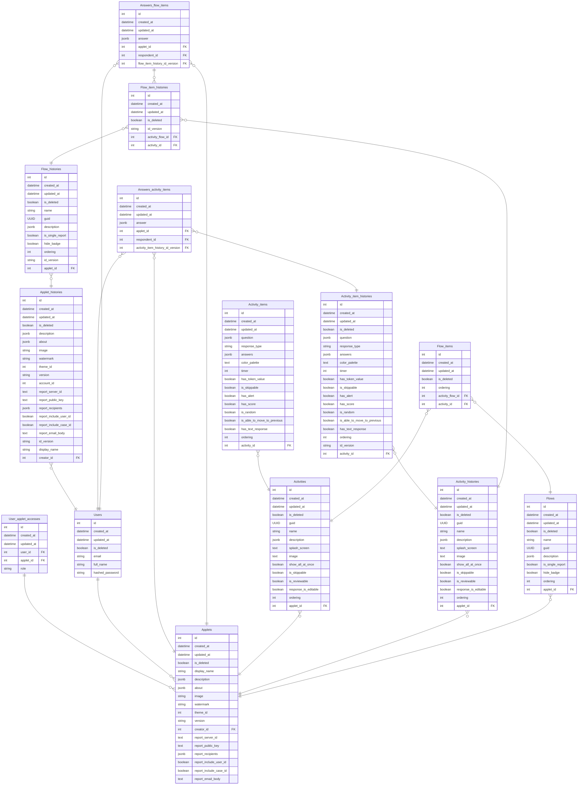

# Database relation structure

```mermaid

erDiagram

User_applet_accesses ||--o{ Applets: ""

    User_applet_accesses {
        int id
        datetime created_at
        datetime updated_at
        int user_id FK
        int applet_id FK
        string role
    }

    Users {
        int id
        datetime created_at
        datetime updated_at
        boolean is_deleted
        string email
        string full_name
        string hashed_password
    }

 Users||--o{ Applets : ""

    Applets {
        int id
        datetime created_at
        datetime updated_at
        boolean is_deleted
        string display_name
        jsonb description
        jsonb about
        string image
        string watermark
        int theme_id
        string version
        int creator_id FK
        text report_server_id
        text report_public_key
        jsonb report_recipients
        boolean report_include_user_id
        boolean report_include_case_id
        text report_email_body
    }

Applet_histories }o--|| Users: ""

    Applet_histories {
        int id
        datetime created_at
        datetime updated_at
        boolean is_deleted
        jsonb description
        jsonb about
        string image
        string watermark
        int theme_id
        string version
        int account_id
        text report_server_id
        text report_public_key
        jsonb report_recipients
        boolean report_include_user_id
        boolean report_include_case_id
        text report_email_body
        string id_version
        string display_name
        int creator_id FK
    }

Answers_activity_items }o--|| Applets: ""
Answers_activity_items }o--|| Users: ""
Answers_activity_items }o--|| Activity_item_histories: ""

    Answers_activity_items {
        int id
        datetime created_at
        datetime updated_at
        jsonb answer
        int applet_id FK
        int respondent_id FK
        int activity_item_history_id_version FK
    }

Answers_flow_items }o--|| Applets: ""
Answers_flow_items }o--|| Users: ""
Answers_flow_items ||--o{ Flow_item_histories: ""

    Answers_flow_items {
        int id
        datetime created_at
        datetime updated_at
        jsonb answer
        int applet_id FK
        int respondent_id FK
        int flow_item_history_id_version FK
    }

Activities }o--|| Applets: ""

    Activities {
        int id
        datetime created_at
        datetime updated_at
        boolean is_deleted
        UUID guid
        string name
        jsonb description
        text splash_screen
        text image
        boolean show_all_at_once
        boolean is_skippable
        boolean is_reviewable
        boolean response_is_editable
        int ordering
        int applet_id FK
    }

Activity_histories }o--|| Applets: ""

    Activity_histories {
        int id
        datetime created_at
        datetime updated_at
        boolean is_deleted
        UUID guid
        string name
        jsonb description
        text splash_screen
        text image
        boolean show_all_at_once
        boolean is_skippable
        boolean is_reviewable
        boolean response_is_editable
        int ordering
        int applet_id FK
    }

Activity_item_histories }o--|| Activity_histories: ""

    Activity_item_histories {
        int id
        datetime created_at
        datetime updated_at
        boolean is_deleted
        jsonb question
        string response_type
        jsonb answers
        text color_palette
        int timer
        boolean has_token_value
        boolean is_skippable
        boolean has_alert
        boolean has_score
        boolean is_random
        boolean is_able_to_move_to_previous
        boolean has_text_response
        int ordering
        string id_version
        int activity_id FK
    }

Activity_items }o--|| Activities: ""

    Activity_items {
        int id
        datetime created_at
        datetime updated_at
        jsonb question
        string response_type
        jsonb answers
        text color_palette
        int timer
        boolean has_token_value
        boolean is_skippable
        boolean has_alert
        boolean has_score
        boolean is_random
        boolean is_able_to_move_to_previous
        boolean has_text_response
        int ordering
        int activity_id FK
    }


Flows }o--|| Applets: ""

    Flows {
        int id
        datetime created_at
        datetime updated_at
        boolean is_deleted
        string name
        UUID guid
        jsonb description
        boolean is_single_report
        boolean hide_badge
        int ordering
        int applet_id FK
    }

Flow_items }o--|| Flows: ""
Flow_items }o--|| Activities: ""

    Flow_items {
        int id
        datetime created_at
        datetime updated_at
        boolean is_deleted
        int ordering
        int activity_flow_id FK
        int activity_id FK
    }

Flow_item_histories }o--|| Flow_histories: ""
Flow_item_histories }o--|| Activity_histories: ""

    Flow_item_histories {
        int id
        datetime created_at
        datetime updated_at
        boolean is_deleted
        string id_version
        int activity_flow_id FK
        int activity_id FK
    }

Flow_histories }o--|| Applet_histories: ""

    Flow_histories {
        int id
        datetime created_at
        datetime updated_at
        boolean is_deleted
        string name
        UUID guid
        jsonb description
        boolean is_single_report
        boolean hide_badge
        int ordering
        string id_version
        int applet_id FK
    }


```