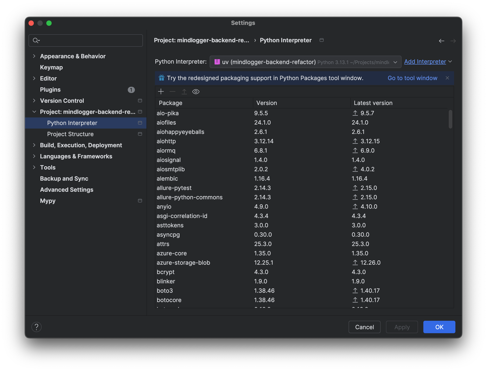
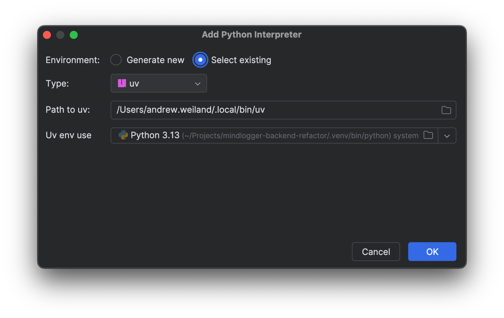
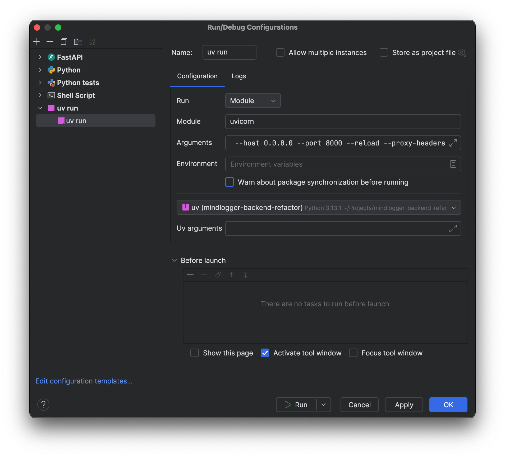
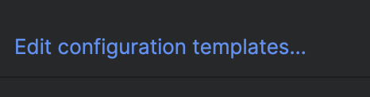
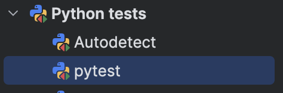
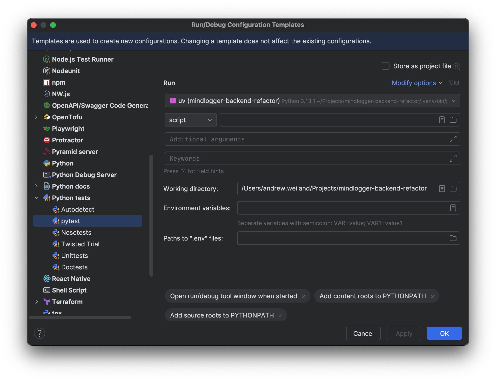

# Pycharm

## Setting uv as the project interpreter

> This assumes that you have already performed the project setup and run `uv sync`

Open the Pycharm command window (`⌘,`) and navigate to Project ➡️ Python Interpreter

Click the *Add Interpreter* link to bring up the interpreter window.

- Choose *Select existing*
- For *Type* select *uv*
- Set your path to uv (this might be autodetected)
- Select the virtual env uv created in the project

Click OK and close out

---

## Running the project

Create a new run configuration and select *uv run* as the type.

- Give it a name
- Run type is *Module*
- The *Arguments* are: `src.main:app --proxy-headers --host 0.0.0.0 --port 8000 --reload`
- Uncheck *Warn about package synchronization before running*

---

## Debug Configuration

The default debug configuration template in Pycharm is not compatible with
the application setup.  It needs to be customized in order to allow clicking
the run and debug shortcuts in the Pycharm gutter to work without further configuration.

Open the Run Configurations window.  Click *Edit configuration templates* in the
bottom left corner

Navigate to *Python tests* ➡️ *pytest*

This will bring up the default template for creating *pytest* run/debug default configurations.

- Select the uv interpreter created above
- Set the working directory to the project's root directory